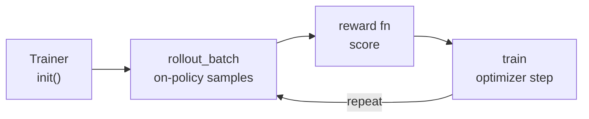

👋 Hi, everyone! AReno is a fast, effortless, and self-contained toolkit that
scales RL post-training up locally, initiated by the inclusionAI ASystem team
and maintained by the AReno community.

<p align="center">
  <a href="LICENSE"></a>
  <a href="https://www.python.org/downloads/"></a>
  <a href="https://pytorch.org/"></a>
</p>

<!-- TODO: replace with the project logo when ready -->
<p align="center">
  
</p>

## AReno: ASystem Reinforcement Learning Nano

AReno is a local LLM post-training toolkit for RL, SFT/DPO-style training, serving, and agentic RL. It was originally developed by engineers from the ASystem Team at Ant Group.

Built on a **self-contained, full-stack design**, AReno is optimized to extract maximum performance from a single node, making it well-suited for **fast, local post-training** with no external training or inference backend in the loop.

AReno's mission is to make LLM RL **accessible** for a broad community of researchers and developers — so you can go from a base checkpoint to a trained, served model on a single node, without standing up a cluster or wiring together a training framework, an inference server, and a kernel library.

> Small but complete, like its name — nano in footprint, full-stack in
> capability. We hope AReno makes scaling up your ideas locally both fast and
> delightful. Enjoy!

## Highlights

- ✨ **Plug-and-play**: various post-training methods are easily accessible via the `--algo` flag or the same `Trainer` class from Python, no cluster or launcher to set up.
- 🪶 **Lightweight**: single self-contained package, no external training/inference backend, just PyTorch, FlashAttention, and a handful of other libraries.
- 🧰 **Agentic RL ready**: run an agent function against AReno's local OpenAI-compatible proxy, return explicit trajectories, and train from tokens, logprobs, rewards, and loss masks derived by the trainer.
- 🧩 **Extensible**: easily register new algorithms, model adapters, reward functions, and hardware backends without changing the core.

## Installation

**Requirements:**

- Linux with an NVIDIA GPU (CUDA compute capability 8.0+)
- CUDA toolkit, with `CUDA_HOME` set (so `nvcc` is on the build path)
- PyTorch >= 2.6, matching your installed CUDA version

> **Other platforms:** Apple Silicon (M-series) and AMD GPUs are not supported —
> the engine requires NVIDIA CUDA. On Windows, install under
> [WSL2](https://learn.microsoft.com/windows/wsl/) and follow the Linux
> instructions. DGX Spark and other Grace/Blackwell systems work, but install an
> `aarch64` PyTorch build first.

**To install:**

```bash
pip install psutil
pip install flash-attn flash-linear-attention
pip install areno --no-build-isolation
```

`--no-build-isolation` is required so that pip uses your existing CUDA-enabled PyTorch instead of installing a CPU-only torch in an isolated build environment.
Because build isolation is disabled, build-time helpers are not installed automatically; `psutil` must already be present because PyTorch's CUDA extension builder imports it while sizing parallel compile jobs.

After installation, run `areno check` for an actionable readiness check. Use
`areno env --json` when opening an issue so maintainers can see the Python,
CUDA, PyTorch, GPU, and extension state without guessing from low-level build
errors.

**From source** (recommended if you want the examples or plan to contribute):

```bash
git clone https://github.com/inclusionAI/asystem-areno.git
cd asystem-areno
pip install psutil
pip install flash-attn flash-linear-attention
pip install -e . --no-build-isolation
```

**Tips:**

- Install `ninja` (`pip install ninja`) before building so CUDA kernels compile in parallel.
- If installation fails with `No module named 'psutil'`, install it first (`pip install psutil`) and retry. This is required specifically for `--no-build-isolation` builds.
- Install `flash-attn` before AReno so the local build can reuse the already-installed package. If building `flash-attn` from source is too slow for your environment, install a pre-built wheel from the [flash-attention releases](https://github.com/Dao-AILab/flash-attention/releases) that matches your Python, PyTorch, CUDA, and platform.
- By default, source builds target the visible GPU architecture. To build for a specific GPU family or when building on a host where the target GPU is not visible, set `TORCH_CUDA_ARCH_LIST` explicitly. Common values are `9.0` for H100/H200, `8.0` for A100, and `8.9` for L40/RTX 4090:
  ```bash
  TORCH_CUDA_ARCH_LIST="9.0" MAX_JOBS=64 pip install -e . --no-build-isolation
  ```
- If your machine has many CPU cores but limited RAM, cap the parallel build jobs with `MAX_JOBS`:
  ```bash
  MAX_JOBS=4 pip install -e . --no-build-isolation
  ```
- For iterative CUDA development, enable `ccache` before rebuilding:
  ```bash
  export CC="ccache gcc"
  export CXX="ccache g++"
  ```
- To install the Python package without building the CUDA extension (for docs/metadata or a dry run), set `ARENO_BUILD_EXT=0`. The engine will not run without the extension, but the installation will succeed.

## Quick Start

With the SDK, RL loop is a short cycle of `Trainer` calls. Each step below maps a concept to the SDK call that performs it:



1. **Create the trainer** — construct a `Trainer` on the AReno backend and `init()` it to load the tokenizer and start workers.
2. **Roll out** — inside `rollout_session(...)`, `rollout_batch(...)` generates on-policy completions for each prompt.
3. **Score** — reward each completion and turn rewards into advantages (your reward function, not AReno's).
4. **Train** — pack the rollout into `TrainSequence` objects and call `train(batch, loss_fn)` to run one optimizer step.
5. **Repeat** — new weights produce new rollouts; loop until done, then `close()`.

```python
import asyncio
from functools import partial

from datasets import load_dataset

from areno.api import (
    Areno,
    ArenoConfig,
    SamplingParams,
    Trainer,
    TrainSequence,
    gspo_loss_fn,
)
from examples.math.math_verify_reward import reward_fn


def to_advantages(rewards):
    mean = sum(rewards) / len(rewards)
    var = sum((r - mean) ** 2 for r in rewards) / max(len(rewards), 1)
    std = max(var**0.5, 1e-6)
    return [(r - mean) / std for r in rewards]


async def main():
    # 1. Create the trainer
    trainer = Trainer(
        world_size=1,
        model_path="Qwen/Qwen3-0.6B",
        backend_type=Areno,
        custom_config=ArenoConfig(tp_size=1),
    )
    trainer.init()

    try:
        # 2. Roll out on-policy completions for one GSM8K prompt
        row = load_dataset("gsm8k", "main", split="train[0:1]")[0]
        prompt = (
            "Solve the problem and put the final answer in \\boxed{}.\n\n"
            f"Problem: {row['question']}\nSolution:"
        )
        prompt_tokens = trainer.get_tokenizer().encode(prompt)
        sampling = SamplingParams(max_new_tokens=512, temperature=1.0)

        async with trainer.rollout_session(sampling_params=sampling, proxy=False):
            rollout = trainer.rollout_batch(
                [prompt],
                n_samples=8,
                sampling_params=sampling,
            )[0]

        # 3. Score with the same reward function the CLI uses, then form advantages
        completions = [trainer.get_tokenizer().decode(seq.resp_tokens) for seq in rollout.sequences]
        rewards = reward_fn(row, completions)
        advantages = to_advantages(rewards)

        batch = []
        for seq, reward, advantage in zip(rollout.sequences, rewards, advantages, strict=True):
            response_len = len(seq.resp_tokens)
            batch.append(
                TrainSequence(
                    prompt_mask=[True] * len(prompt_tokens) + [False] * response_len,
                    tokens=prompt_tokens + seq.resp_tokens,
                    logprobs=[0.0] * len(prompt_tokens) + seq.resp_logprobs,
                    advantages=[0.0] * len(prompt_tokens) + [advantage] * response_len,
                    reward=reward,
                    eos_token_id=trainer.get_tokenizer().eos_token_id,
                )
            )

        # 4. Train one step
        stats = trainer.train(batch, partial(gspo_loss_fn, clip_eps=3.0e-4), mini_bs=4)

        # 5. Repeat the loop over more prompts
    finally:
        trainer.close()


asyncio.run(main())
```

See the documentation for the full `Trainer` API.

## Command Line Interface (CLI)

You can use the AReno Command Line Interface (CLI) to quickly get started with post-training without writing any Python.

### Diagnostics

Check whether the current machine is ready to run AReno:

```bash
areno check
```

`areno check` prints `OK`, `WARN`, and `FAIL` statuses with concrete next steps for common setup issues such as missing CUDA, CPU-only PyTorch, missing `CUDA_HOME`, unavailable `nvcc`, missing optional runtime dependencies, or a missing `areno_accel` extension.

For issue reports, collect a descriptive environment report:

```bash
areno env --json
```

The report includes AReno, Python, platform, PyTorch/CUDA, GPU, `nvcc`, dependency import status, and relevant environment variables.

### Training

#### Tiny training smoke test

Use this command when you only want to check that a machine can run one small official training task end to end:

```bash
areno train \
  --ckpt Qwen/Qwen3-0.6B \
  --dataset-path gsm8k:main \
  --dataset-loader-fn examples/math/dataset_loader.py \
  --reward-fn-path examples/math/math_verify_reward.py \
  --algo gspo \
  --tp-size 1 \
  --world-size 1 \
  --batch-size 1
```

This is a smoke/sanity task for the CLI, dataset loader, reward function, rollout, and training-step wiring. It is not a quality benchmark. It requires a CUDA-capable NVIDIA GPU; CPU-only machines can install the package for docs and metadata checks, but cannot run the AReno training engine. A successful run should reach rollout logs and a `train_stats=...` line without raising an exception.

Run GSPO on a GSM8K-style dataset with a reward function:

```bash
areno train \
  --ckpt Qwen/Qwen3-0.6B \
  --dataset-path gsm8k:main \
  --dataset-loader-fn examples/math/dataset_loader.py \
  --reward-fn-path examples/math/math_verify_reward.py \
  --algo gspo \
  --tp-size 4
```

`--ckpt` and `--dataset-path` accept either local paths or Hugging Face repo IDs. Switch algorithms by changing `--algo` (e.g. `--algo grpo`, `--algo sft`).

For Agentic RL, add `--agent-fn` to supply an agent function. The agent calls the local OpenAI-compatible endpoint, including `tools` and `tool_choice` when needed, and returns explicit `AgentTrajectoryTurn` objects. AReno converts those turns into trainable assistant outputs and masks tool results by default:

```bash
python examples/agentic/tictactoe/dataset_generator.py \
  --output /tmp/areno-tictactoe.jsonl \
  --count 2048 \
  --seed 2026
```

```bash
areno train \
  --ckpt Qwen/Qwen3-0.6B \
  --dataset-path /tmp/areno-tictactoe.jsonl \
  --dataset-loader-fn examples/agentic/tictactoe/dataset_loader.py \
  --reward-fn-path examples/agentic/tictactoe/reward.py \
  --agent-fn examples/agentic/tictactoe/run_agent.py \
  --algo gspo \
  --tp-size 1 \
  --world-size 1
```

For the full list of training options, run `areno train --help`.

### Serving

Serve a trained checkpoint as an OpenAI-compatible endpoint with continuous batching:

```bash
areno serve \
  --model-path /path/to/model \
  --tp-size 1 \
  --world-size 1 \
  --port 8000
```

Point any OpenAI client at `http://localhost:8000/v1/chat/completions` to start generating. For the full list of serving options, run `areno serve --help`.

## Development

If you want to contribute to AReno or customize it for your own needs, read the [contribution guide](CONTRIBUTING.md) and make a development install:

```bash
git clone https://github.com/inclusionAI/asystem-areno.git
cd asystem-areno
pip install psutil
pip install flash-attn flash-linear-attention
pip install -e . --no-build-isolation
```

New algorithms, model adapters, kernels, reward functions, and hardware backends all have first-class extension points, so most contributions land without forking the core.

## Citation and Acknowledgement

If you find the project helpful, please cite:

```bibtex
@misc{areno2026,
  title        = {AReno: A Self-Contained, Full-Stack Toolkit for Single-Node LLM RL Post-Training},
  author       = {Zibo He and Le Su and Zongyu Li},
  year         = {2026},
  url          = {https://github.com/inclusionAI/asystem-areno},
  license      = {Apache-2.0}
}
```

AReno's API design is inspired by [Tinker](https://github.com/ThinkingMachine/Tinker) from ThinkingMachines. We would like to express our gratitude for their pioneering work.

## License

This repository's source code is available under the [Apache 2.0 License](LICENSE).
